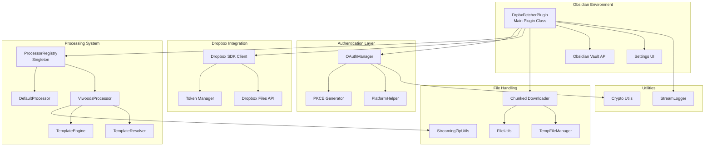

# Drpbx-Fetcher Plugin Architecture Specification

**Version:** 0.2.81
**Last Updated:** 2025-10-17

## Table of Contents

1. [Overview](#overview)
2. [System Architecture](#system-architecture)
3. [Core Components](#core-components)
4. [File Fetching Flow](#file-fetching-flow)
5. [File Processing Pipeline](#file-processing-pipeline)
6. [Processor System](#processor-system)
7. [OAuth Authentication](#oauth-authentication)
8. [Data Models](#data-models)
9. [Key Design Patterns](#key-design-patterns)
10. [Platform Support](#platform-support)

---

## Overview

The Drpbx-Fetcher plugin is an Obsidian plugin that automatically fetches and processes files from Dropbox folders to an Obsidian vault. It provides:

- **OAuth 2.0 Authentication** with PKCE for secure Dropbox access
- **Folder Mapping** system to sync specific Dropbox folders to vault locations
- **Extensible Processor Architecture** for custom file processing
- **Specialized Viwoods Processor** for handling proprietary note formats
- **Chunked Downloads** for memory-efficient handling of large files
- **Cross-Platform Support** (Desktop, Android, iOS)
- **Duplicate Detection** to avoid re-downloading unchanged files

---

## System Architecture

### High-Level Component Diagram



---

## Core Components

### 1. DrpbxFetcherPlugin (main.ts)

**Responsibilities:**
- Main plugin lifecycle management
- Orchestrates file fetching process
- Manages Dropbox client connection
- Handles status bar updates
- Coordinates between components

**Key Methods:**
- `onload()` - Initialize plugin, register processors, schedule initial fetch
- `syncFiles()` - Main fetch orchestration method
- `getDropboxClient()` - Create/refresh Dropbox client with token management
- `getAllFiles()` - Paginated fetching of Dropbox folder contents
- `downloadFileInChunks()` - Memory-efficient chunked file download
- `downloadFileInChunksToDisk()` - Stream chunks directly to disk

**Location:** `/main.ts:15-913`

---

### 2. OAuthManager (src/auth/OAuthManager.ts)

**Responsibilities:**
- Handles OAuth 2.0 authentication flow
- Manages PKCE code generation and verification
- Platform-specific authentication (desktop vs mobile)
- Token exchange and storage

**Authentication Flows:**

**Desktop Flow:**
1. Generate PKCE verifier and challenge
2. Start local HTTP server on port 53134
3. Open browser to Dropbox authorization URL
4. Receive callback with authorization code
5. Exchange code for access + refresh tokens
6. Close local server

**Mobile Flow:**
1. Generate PKCE verifier and challenge
2. Store auth state in settings
3. Open external browser with custom URI redirect
4. Handle callback via Obsidian protocol handler
5. Exchange code for tokens

**Location:** `/src/auth/OAuthManager.ts:7-229`

---

### 3. ProcessorRegistry (src/processors/ProcessorRegistry.ts)

**Responsibilities:**
- Singleton registry for file processors
- Maps file extensions/paths to processors
- Provides processor lookup and routing

**Key Methods:**
- `register(processor)` - Register a new processor
- `getByExtension(ext, mappings)` - Find processor by file extension
- `findProcessorForFile(path, ext, mappings)` - Smart routing (extension + path-based)
- `listAll()` - Get all registered processors

**Processor Routing Logic:**
1. **Extension-based routing** - Match file extension to configured mapping
2. **Path-based routing** - Use `canHandleFile()` hook for custom logic
3. **Fallback** - Return null if no processor matches

**Location:** `/src/processors/ProcessorRegistry.ts:7-134`

---

### 4. File Processors

#### DefaultProcessor (src/processors/DefaultProcessor.ts)

Simple pass-through processor that copies files without modification.

**Configuration:**
- `outputFolder` - Destination folder in vault

**Location:** `/src/processors/DefaultProcessor.ts:16-96`

#### ViwoodsProcessor (src/processors/ViwoodsProcessor/index.ts)

Complex processor for proprietary Viwoods note format (.note files are ZIP archives).

**Supported Modules:**
- **Learning** - EPUB/PDF reading notes and annotations
- **Paper** - Handwritten notes on blank paper
- **Daily** - Daily journal entries
- **Meeting** - Meeting notes
- **Picking** - Quick captures/screenshots
- **Memo** - Text memos

**Module Detection:**
1. Parse `HeaderInfo.json` package name (most reliable)
2. Analyze file structure (presence of specific JSON files)
3. Path-based detection (folder names)

**Processing Flow:**
1. Load .note file as ZIP archive
2. Detect module type
3. Route to specialized module processor
4. Extract JSON metadata
5. Extract and process images/content
6. Render Markdown using templates
7. Write output files to vault

**Location:** `/src/processors/ViwoodsProcessor/index.ts:37-763`

---

### 5. Utilities

#### StreamingZipUtils (src/utils/StreamingZipUtils.ts)

Memory-efficient ZIP processing using `@zip.js/zip.js`.

**Key Features:**
- Streaming extraction (doesn't load entire ZIP)
- Android compatibility (disables native DecompressionStream)
- Individual file extraction from ZIP

**Location:** `/src/utils/StreamingZipUtils.ts:16-145`

#### TemplateEngine (src/processors/templates/TemplateEngine.ts)

Simple template rendering system.

**Syntax:**
- `{{variable}}` - Variable replacement
- `{{date:FORMAT}}` - Formatted date
- `{{time:FORMAT}}` - Formatted time

**Location:** `/src/processors/templates/TemplateEngine.ts:10-97`

#### StreamLogger (src/utils/StreamLogger.ts)

Configurable logging system supporting console and network streaming.

**Modes:**
- `console` - Standard console logging
- `stream` - Network logging to external server (debugging on mobile)

---

## File Fetching Flow

### Complete Fetch Sequence


---

## File Processing Pipeline

### Processing Decision Flow


---

## Processor System

### Processor Architecture


### Processor Routing Logic

The `ProcessorRegistry` uses a two-stage routing system:

1. **Extension-based routing** (primary)
   - Look up configured `FileTypeMapping` by file extension
   - Check if mapping is enabled
   - Get processor by `processorType` field

2. **Path-based routing** (fallback)
   - Iterate through all enabled mappings
   - Call `processor.canHandleFile(path, ext, config)`
   - First processor that returns `true` wins

**Example:** ViwoodsProcessor uses path-based routing to claim all files in Viwoods module folders (`/Learning/`, `/Paper/`, etc.) regardless of extension.

---

## OAuth Authentication

### Desktop OAuth Flow


### Mobile OAuth Flow


---

## Data Models

### Settings (src/models/Settings.ts)

```typescript
interface DrpbxFetcherSettings {
  // Authentication
  accessToken: string;
  refreshToken: string;
  clientId: string;
  codeVerifier: string;
  authInProgress: boolean;

  // Folder mappings
  folderMappings: FolderMapping[];

  // File type mappings (processor configuration)
  fileTypeMappings: FileTypeMapping[];

  // Skip configuration
  skippedExtensions: string[];

  // Tracking
  processedFiles: Record<string, number>; // file.id → size

  // Fetch settings
  syncOnStartup: boolean;
  syncStartupDelay: number;

  // Download settings
  maxFileSizeMobile: number;
  chunkSizeBytes: number;
  chunkedDownloadThreshold: number;

  // Logging
  loggerType: 'console' | 'stream';
  streamLogHost: string;
  streamLogPort: number;
}

interface FolderMapping {
  remotePath: string;  // Dropbox path (starts with /)
  localPath: string;   // Vault path (relative, no leading /)
}

interface FileTypeMapping {
  id: string;              // Unique ID
  extension: string;       // File extension (no dot)
  processorType: string;   // Processor type identifier
  enabled: boolean;        // Active state
  config: ProcessorConfig; // Processor-specific config
}
```

### Processor Configuration

**Base Interface:**
```typescript
interface ProcessorConfig {
  [key: string]: unknown;
}
```

**ViwoodsProcessorConfig:**
```typescript
interface ViwoodsProcessorConfig extends ProcessorConfig {
  learning: LearningModuleConfig;
  paper: PaperModuleConfig;
  daily: DailyModuleConfig;
  meeting: MeetingModuleConfig;
  picking: PickingModuleConfig;
  memo: MemoModuleConfig;
}

interface LearningModuleConfig {
  enabled: boolean;
  highlightsFolder: string;
  annotationsFolder: string;
  sourcesFolder: string;
  highlightTemplate?: string;
  annotationTemplate?: string;
  includeMetadata: boolean;
  includeThumbnail: boolean;
  extractImages: boolean;
  processAnnotations: boolean;
  annotationImagesFolder: string;
  includeSummaryInAnnotation: boolean;
  createCompositeImages: boolean;
  downloadSourceFiles?: boolean; // Whether to download source files (.epub, .note) to Sources folder
}
```

---

## Key Design Patterns

### 1. Singleton Pattern
**Usage:** `ProcessorRegistry`
- Ensures single registry instance across plugin
- Global access point for processor lookup

### 2. Strategy Pattern
**Usage:** File Processors
- Different processing strategies for different file types
- Runtime selection based on file extension/path
- Easy to add new processors

### 3. Factory Pattern
**Usage:** Dropbox Client Creation
- `getDropboxClient()` creates configured client
- Handles token refresh transparently
- Wraps Obsidian's `requestUrl` as fetch API

### 4. Template Method Pattern
**Usage:** Processor Base Interface
- Defines processing skeleton (`process` method)
- Subclasses implement specific processing logic
- Common hooks: `shouldSkipFile`, `canHandleFile`

### 5. Observer Pattern
**Usage:** Status Bar Updates
- Plugin notifies user of progress through status bar
- Non-blocking progress reporting
- Automatic cleanup after delay

### 6. Adapter Pattern
**Usage:** `obsidianFetch` function
- Adapts Obsidian's `requestUrl` to standard Fetch API
- Allows Dropbox SDK to work in Obsidian environment
- Handles platform-specific quirks (Android Content-Type)

---

## Platform Support

### Desktop (Windows, macOS, Linux)
- OAuth via local HTTP server on port 53134
- Full access to Node.js APIs (`http` module)
- No file size restrictions
- Native `DecompressionStream` API supported

### Mobile (Android, iOS)
- OAuth via custom URI scheme (`obsidian://dropbox-callback`)
- Limited to Obsidian's provided APIs
- File size limits configurable (default: 10MB)
- Android: Requires Content-Type header workarounds
- Android: Uses JavaScript-based ZIP decompression (no native API)

### Platform Detection
**Location:** `src/utils/platform.ts`

```typescript
class PlatformHelper {
  static isDesktop(): boolean
  static isMobile(): boolean
  static isAndroid(): boolean
  static isIOS(): boolean
  static getPlatformName(): string
  static getRedirectUri(): string
}
```

### Platform-Specific Behaviors

**Chunked Downloads:**
- Desktop: Directly into memory (Uint8Array)
- Mobile: Can stream to disk via `TempFileManager`

**ZIP Decompression:**
- Desktop: Can use native DecompressionStream
- Android: Uses JavaScript fallback (native doesn't support 'deflate-raw')

**File Size Limits:**
- Desktop: No limits (respects `chunkedDownloadThreshold`)
- Mobile: Respects `maxFileSizeMobile` setting

---

## Performance Optimizations

### 1. Early Filtering
Files can be skipped before download:
- Processor `shouldSkipFile()` hook
- Extension-based filtering
- Mobile size limit checks
- Duplicate detection (file ID + size tracking)

### 2. Chunked Downloads
Large files downloaded in configurable chunks:
- Default: 2MB chunks for files > 10MB
- Uses HTTP Range requests
- Reduces memory pressure
- Progress reporting per chunk

### 3. Streaming ZIP Processing
Uses `@zip.js/zip.js` instead of JSZip:
- Doesn't load entire ZIP into memory
- Extracts files on-demand
- Better for large archives

### 4. Pagination
Dropbox folder listing uses cursors:
- Fetches 1000 files per request
- Continues with cursor if `has_more`
- Avoids hitting API limits

### 5. Duplicate Detection
Tracks processed files by Dropbox file ID:
- Maps `file.id` → `file.size`
- Skips if ID + size match (preserves user edits)
- Reprocesses if size changes

---

## Error Handling

### Network Errors
- Token refresh on 401 Unauthorized
- User-friendly messages for common errors (409, 403)
- Retry logic not implemented (single-attempt per fetch)

### Processing Errors
- Errors isolated to individual files (don't stop entire fetch)
- Logged to console and StreamLogger
- Displayed in status bar with timeout
- ProcessorResult includes `errors` and `warnings` arrays

### Platform Errors
- Android Content-Type header fix applied automatically
- Port conflicts handled (EADDRINUSE for OAuth server)
- Mobile auth timeout detection (authInProgress flag)

---

## Future Architecture Considerations

### Extensibility Points
1. **Custom Processors** - Register via `ProcessorRegistry.register()`
2. **Template System** - Custom templates via configuration
3. **Module Processors** - Add new Viwoods modules
4. **Hooks** - `shouldSkipFile`, `canHandleFile`

### Potential Improvements
1. **Incremental Sync** - Delta API instead of full folder scan
2. **Background Sync** - Periodic automatic fetching
3. **Conflict Resolution** - User merge tools for changed files
4. **Queue System** - Batch operations with pause/resume
5. **Caching Layer** - Local cache of Dropbox metadata
6. **Progress API** - More granular progress callbacks
7. **Retry Logic** - Exponential backoff for failed operations

---

## File References

### Core Files
- **Main Plugin:** `main.ts:15-913`
- **Settings Model:** `src/models/Settings.ts:6-74`
- **Processor Registry:** `src/processors/ProcessorRegistry.ts:7-134`
- **Processor Types:** `src/processors/types.ts:8-185`

### Authentication
- **OAuth Manager:** `src/auth/OAuthManager.ts:7-229`
- **PKCE Generator:** `src/utils/crypto.ts`
- **Platform Helper:** `src/utils/platform.ts`

### Processors
- **Default Processor:** `src/processors/DefaultProcessor.ts:16-96`
- **Viwoods Processor:** `src/processors/ViwoodsProcessor/index.ts:37-763`
- **Learning Module:** `src/processors/ViwoodsProcessor/modules/LearningProcessor.ts`
- **Paper Module:** `src/processors/ViwoodsProcessor/modules/PaperProcessor.ts`
- **Daily Module:** `src/processors/ViwoodsProcessor/modules/DailyProcessor.ts`
- **Meeting Module:** `src/processors/ViwoodsProcessor/modules/MeetingProcessor.ts`
- **Picking Module:** `src/processors/ViwoodsProcessor/modules/PickingProcessor.ts`
- **Memo Module:** `src/processors/ViwoodsProcessor/modules/MemoProcessor.ts`

### Utilities
- **Streaming ZIP:** `src/utils/StreamingZipUtils.ts:16-145`
- **ZIP Utils (legacy):** `src/utils/ZipUtils.ts:6-112`
- **File Utils:** `src/utils/FileUtils.ts`
- **Template Engine:** `src/processors/templates/TemplateEngine.ts:10-97`
- **Template Resolver:** `src/processors/templates/TemplateResolver.ts`
- **Stream Logger:** `src/utils/StreamLogger.ts`
- **Temp File Manager:** `src/utils/TempFileManager.ts`

### UI
- **Settings Tab:** `src/ui/SettingsTab.ts`
- **Processor Config Modal:** `src/ui/ProcessorConfigModal.ts`

---

**End of Architecture Specification**
