# Architecture Diagrams: Dropbox Fetcher

**Purpose:** Visual representation of current and proposed architecture
**Format:** Mermaid diagrams (rendered in GitHub/Obsidian)
**Date:** October 2025

---

## Table of Contents
1. [Current Architecture](#current-architecture)
2. [Proposed Architecture](#proposed-architecture)
3. [Data Flow Diagrams](#data-flow-diagrams)
4. [Sequence Diagrams](#sequence-diagrams)
5. [Component Interactions](#component-interactions)

---

## Current Architecture

### High-Level Component View

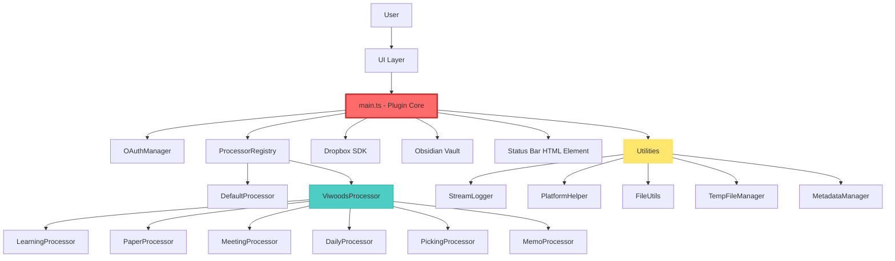

### Current Responsibilities - main.ts

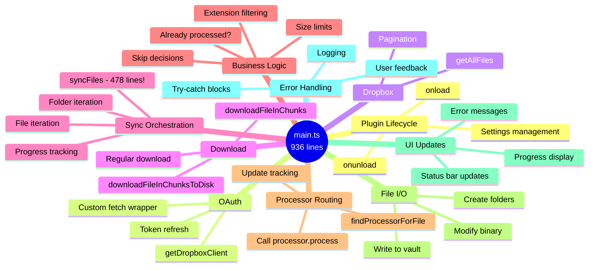

### Current File Structure

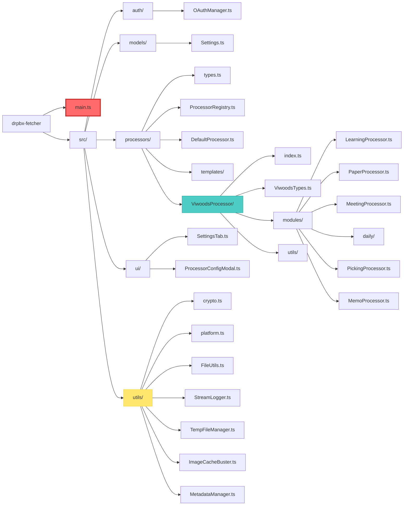

---

## Proposed Architecture

### Clean Architecture Layers

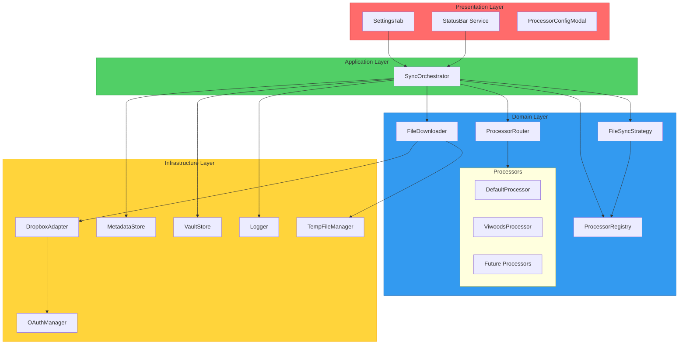

### Proposed File Structure

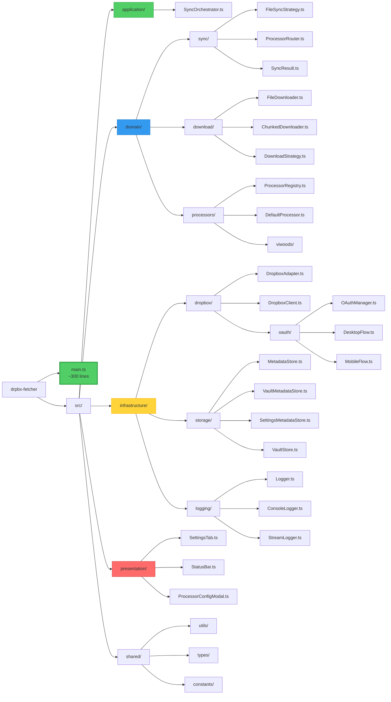

### Dependency Injection Flow

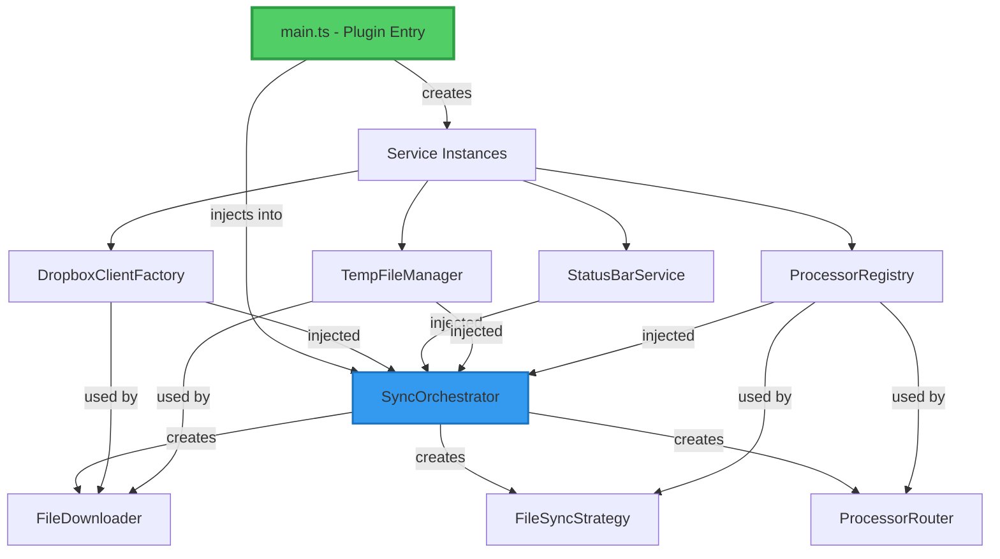

---

## Data Flow Diagrams

### Current: File Sync Flow

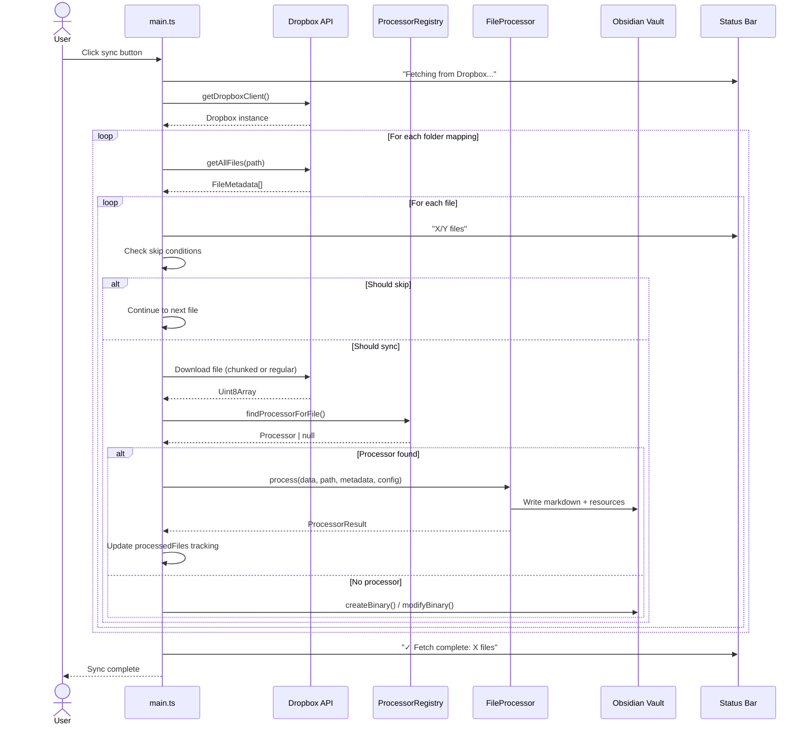

### Proposed: File Sync Flow

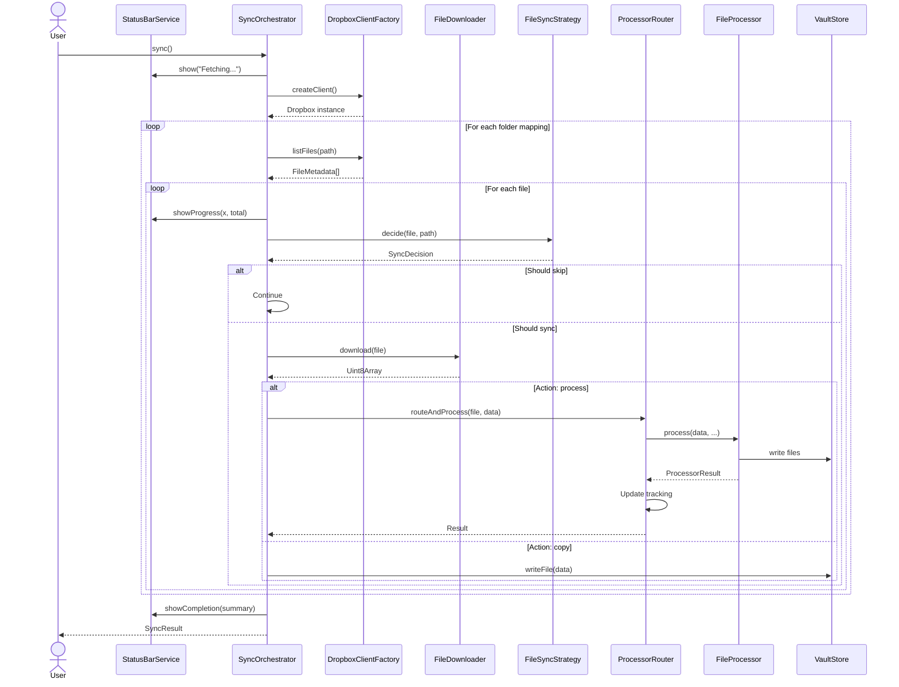

### Metadata Flow

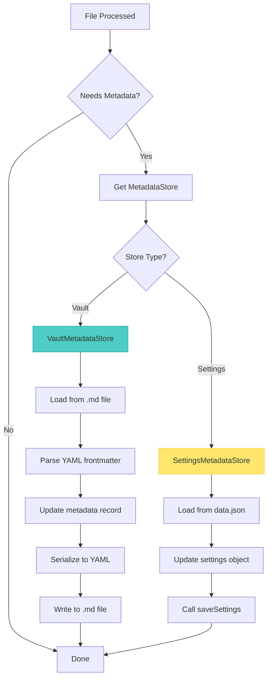

---

## Sequence Diagrams

### OAuth Flow - Desktop

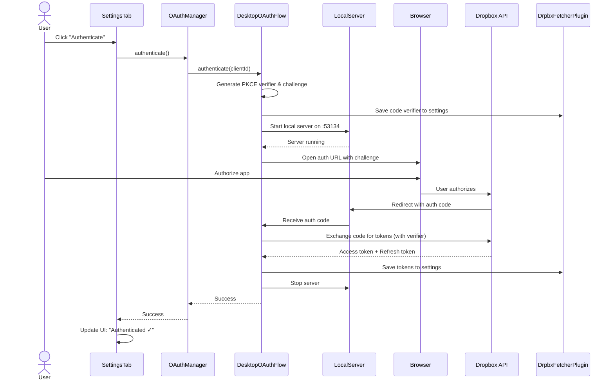

### OAuth Flow - Mobile

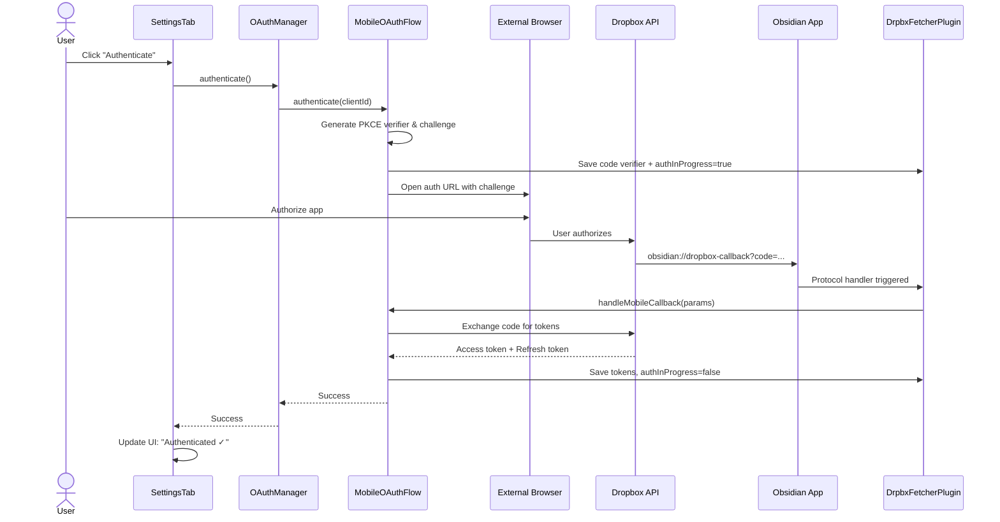

### Processor Execution

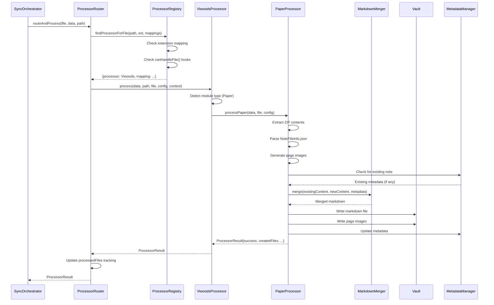

### Error Handling Flow

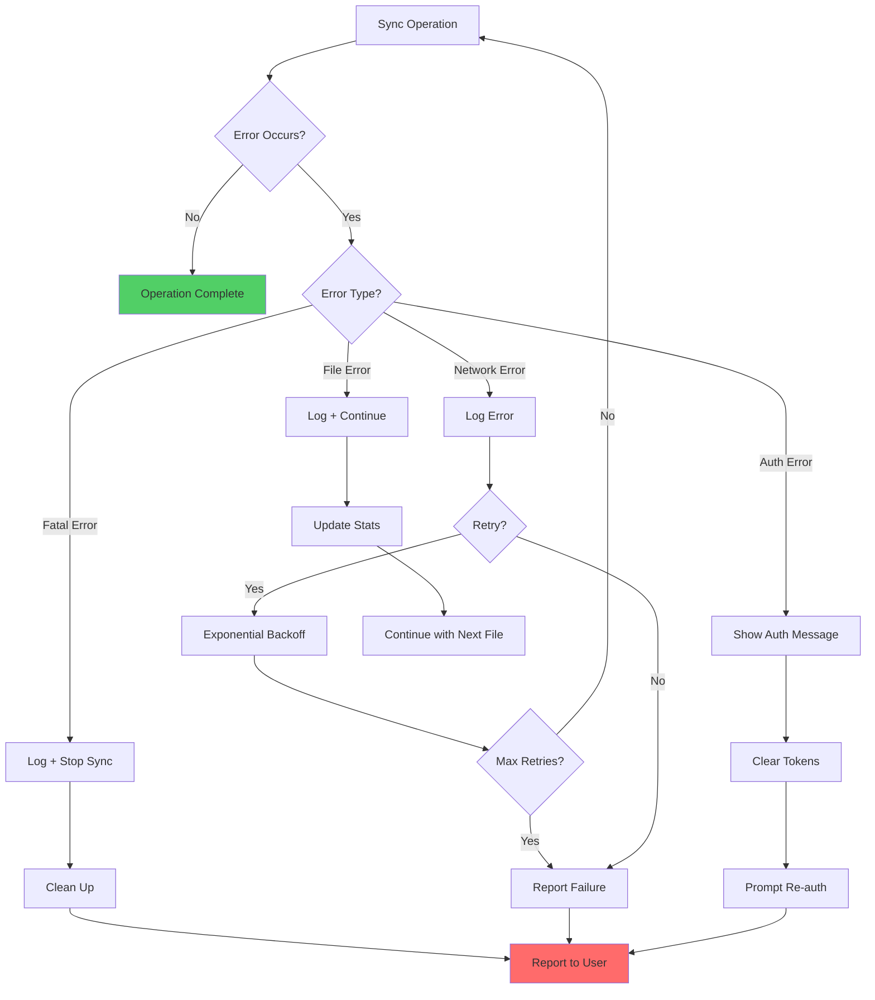

---

## Component Interactions

### Service Dependencies (Current)

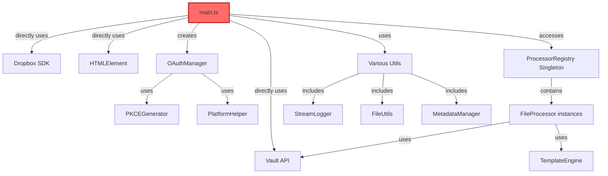

### Service Dependencies (Proposed)

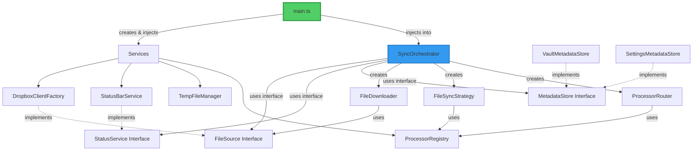

### Processor Pipeline

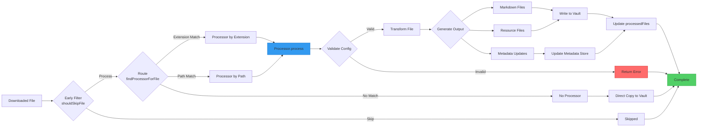

### Settings Flow

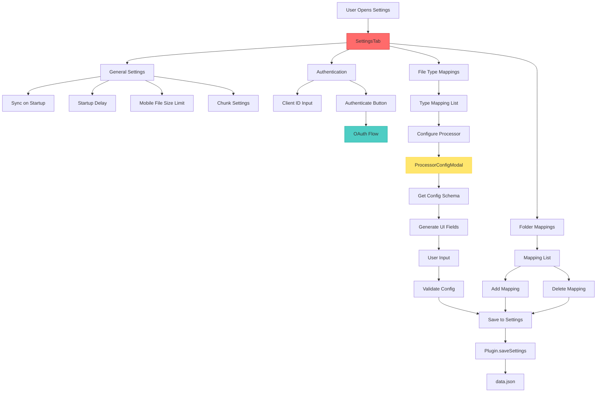

---

## Comparison: Before & After

### Complexity Reduction

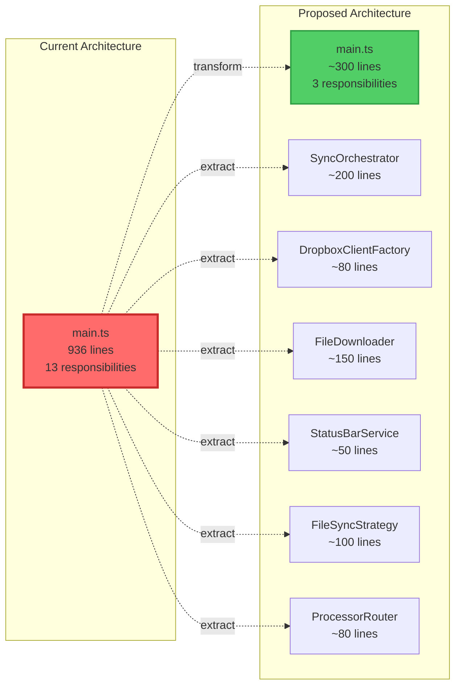

### Testability Improvement

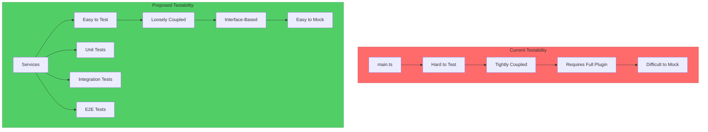

---

## Legend

### Color Coding

- 🔴 **Red**: Current problematic areas or high-risk components
- 🟢 **Green**: Improved/proposed components
- 🔵 **Blue**: Domain/business logic
- 🟡 **Yellow**: Infrastructure/utilities
- 🟣 **Purple**: Presentation/UI

### Diagram Types

- **Graph**: Structure and relationships
- **Sequence**: Time-ordered interactions
- **Mindmap**: Hierarchical concepts
- **Flowchart**: Decision flows and processes

---

## Usage Notes

These diagrams are written in Mermaid syntax and will render in:
- **GitHub** - Automatic rendering in markdown
- **Obsidian** - With Mermaid plugin
- **VS Code** - With Markdown Preview Enhanced extension
- **Online** - https://mermaid.live/

To edit diagrams:
1. Copy Mermaid code
2. Paste into https://mermaid.live/
3. Make changes
4. Copy back to this file

---

**Document Status:** Complete
**Next Document:** QUICK_WINS.md
