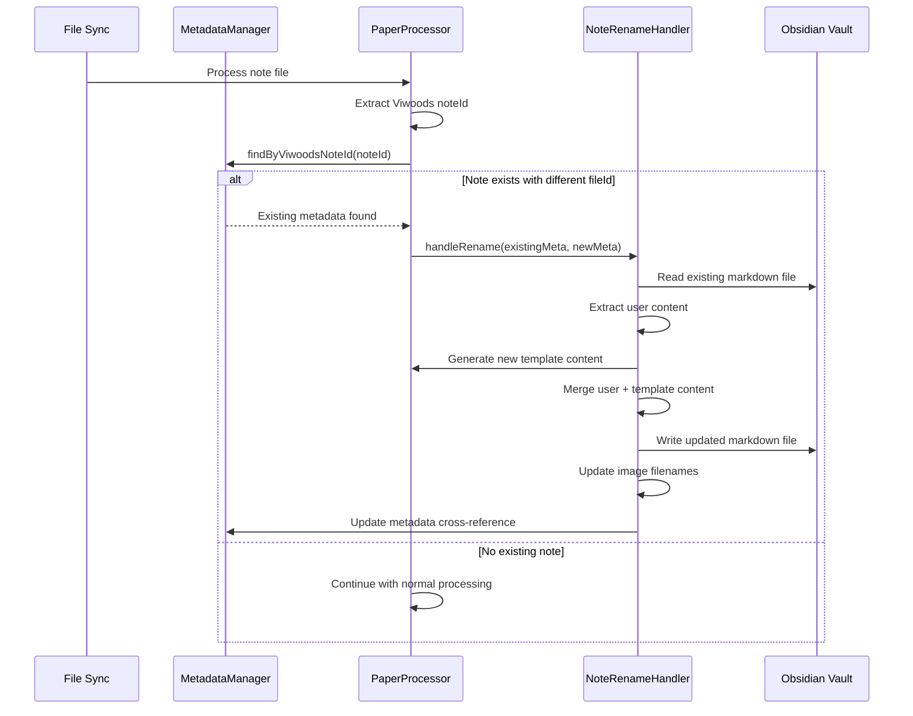

# Rename Detection for Viwoods Notes

## Overview

The plugin implements sophisticated rename detection for Viwoods notes that preserves user edits when notes are renamed in the source app. This system uses Viwoods internal note IDs which remain constant across renames, providing reliable detection.

## Problem Solved

When a note is renamed in Viwoods (and thus in Dropbox), it typically gets a new Dropbox `file.id`. Without rename detection, the plugin would treat this as a completely new file and create duplicate markdown files instead of updating the existing ones.

## Solution Implemented

### 1. Viwoods Internal Note ID Detection

The system uses Viwoods' stable internal identifiers that persist across renames:

- **Paper Module**: Uses `NotesBean.json.id` or `NoteFileInfo.json.uniqueId`
- **Memo Module**: Uses `NotesBean.json.id`
- **Learning Module**: Uses book-level identifiers
- **Other Modules**: Extract IDs from module-specific metadata

### 2. MetadataManager (`src/utils/MetadataManager.ts`)

Core component that handles metadata storage and retrieval:

- **YAML Frontmatter Storage**: Stores `viwoodsNoteId` in generated markdown files
- **Vault-Based Metadata**: Maintains `viwoodsNoteMetadata.md` as cross-reference
- **Bidirectional Lookup**: Supports lookup by both Dropbox `file.id` and Viwoods `noteId`

#### Key Methods:
```typescript
// Store note metadata with both IDs
async storeNoteMetadata(noteId: string, fileId: string, metadata: ViwoodsNoteMetadata)

// Find note by Viwoods internal ID (persists across renames)
async findByViwoodsNoteId(noteId: string): Promise<ViwoodsNoteMetadata | null>

// Find note by Dropbox file ID
async findByDropboxFileId(fileId: string): Promise<ViwoodsNoteMetadata | null>
```

### 3. NoteRenameHandler (`src/utils/NoteRenameHandler.ts`)

Handles the actual file renaming and content updates:

#### Features:
- **File Renaming**: Renames markdown files to match new source filename
- **Image Path Updates**: Updates all image references when note slug changes
- **Link Updates**: Updates internal wiki-style links
- **Metadata Updates**: Updates stored metadata with new file information
- **Content Preservation**: Merges user edits with new template content

#### Rename Process:
1. **Detect Rename**: Compare Viwoods note IDs across sync cycles
2. **Backup User Content**: Extract user-edited sections from existing file
3. **Generate New Content**: Create content using updated template
4. **Merge Content**: Combine template content with user additions
5. **Update References**: Update all internal links and image paths
6. **Cleanup**: Remove orphaned files and update metadata

### 4. MarkdownMerger (`src/processors/ViwoodsProcessor/utils/MarkdownMerger.ts`)

Preserves user edits during content regeneration:

#### Merge Strategy:
- **Protected Sections**: Content between `<!-- USER SECTION -->` markers
- **YAML Frontmatter**: Merges user-added metadata fields
- **Custom Content**: Preserves user-written text outside template areas
- **Template Updates**: Updates template-generated sections while preserving customizations

### 5. Module Integration

Each Viwoods module processor integrates rename detection:

#### PaperProcessor
- Extracts `noteId` from `NotesBean.json.id`
- Handles custom folder structure preservation
- Manages multi-page note renaming

#### MemoProcessor  
- Extracts `noteId` from `NotesBean.json.id`
- Handles todo and reminder metadata preservation
- Manages image white background processing

#### LearningProcessor
- Uses book-level identifiers for stable tracking
- Handles annotation and highlight file organization
- Preserves EPUB source file references

#### DailyProcessor, MeetingProcessor, PickingProcessor
- Extract module-specific identifiers
- Handle respective file organization patterns

## Implementation Details

### Metadata Storage Structure

#### YAML Frontmatter (in each generated file):
```yaml
---
viwoodsNoteId: "17598264557446607"
viwoodsFileId: "id:abc123def456"
created: "2025-01-12T10:30:00.000Z"
lastModified: "2025-01-15T14:20:00.000Z"
sourcePath: "/Viwoods-Note/AiPaper/S3AA2303M02672/Paper/Papers/My Note.note"
---
```

#### Vault Metadata File (`viwoodsNoteMetadata.md`):
```markdown
# Viwoods Note Metadata Cross-Reference

## Paper Notes
- **noteId**: `17598264557446607` → **fileId**: `id:abc123def456` → `My Note.md`
- **noteId**: `17598264557446608` → **fileId**: `id:def456ghi789` → `Another Note.md`

## Memo Notes
- **noteId**: `17598264557446609` → **fileId**: `id:ghi789jkl012` → `Quick Memo.md`
```

### Rename Detection Workflow



### Configuration

Rename detection is controlled per module in processor configuration:

```json
{
  "paper": {
    "enableRenameDetection": true
  },
  "memo": {
    "enableRenameDetection": true
  },
  "learning": {
    "enableRenameDetection": false  // Uses book-level tracking
  }
}
```

## Benefits

### 1. **Content Preservation**
- User edits are never lost during re-fetch
- Custom sections and notes are preserved
- Template updates can be applied safely

### 2. **File Organization**
- Output files stay synchronized with source names
- Image files are renamed consistently
- Internal links remain functional

### 3. **Metadata Accuracy**
- Cross-reference table maintains mapping accuracy
- YAML frontmatter provides file-level tracking
- Supports debugging and manual intervention

### 4. **Performance**
- Efficient lookup using Viwoods internal IDs
- Minimal overhead for files without renames
- Batch processing of multiple renamed files

## Troubleshooting

### Rename Not Detected
1. Check that `enableRenameDetection` is true in module configuration
2. Verify YAML frontmatter contains `viwoodsNoteId` in existing files
3. Ensure `viwoodsNoteMetadata.md` exists and is accessible
4. Check console logs for rename detection messages

### Content Not Preserved
1. Verify existing files have proper YAML frontmatter
2. Check that user content is in unprotected sections
3. Ensure `MarkdownMerger` is correctly identifying custom content
4. Review merge logs for conflicts or issues

### Images Not Updating
1. Verify `ImageCacheBuster` is adding timestamps to image names
2. Check that image paths in markdown are being updated
3. Ensure image files are being renamed with new note slug
4. Verify cleanup of orphaned image files

## Future Enhancements

1. **Cross-Module Rename Detection**: Detect when notes move between modules
2. **Folder Rename Detection**: Handle renamed custom folders in Paper module
3. **Manual Rename Interface**: Allow users to trigger rename detection manually
4. **Rename History**: Track rename history for audit purposes
5. **Conflict Resolution**: Better handling of rename conflicts and duplicates

## Files

- **Core Implementation**: `src/utils/MetadataManager.ts`, `src/utils/NoteRenameHandler.ts`
- **Content Preservation**: `src/processors/ViwoodsProcessor/utils/MarkdownMerger.ts`
- **Module Integration**: Each module processor in `src/processors/ViwoodsProcessor/modules/`
- **Configuration**: Processor configuration in plugin settings
- **Testing**: Comprehensive test coverage for rename scenarios